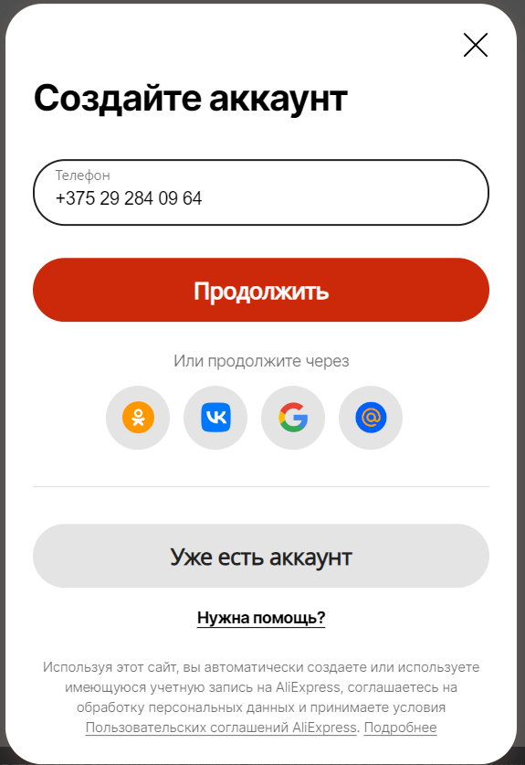
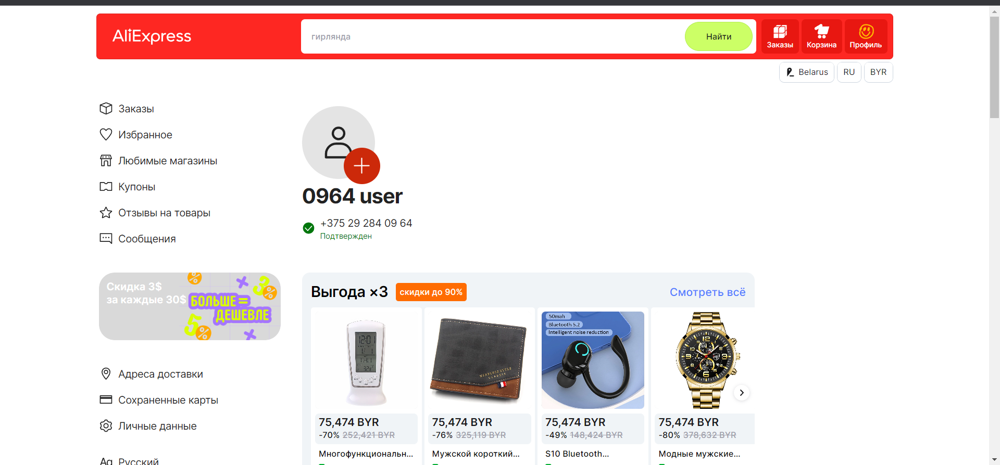
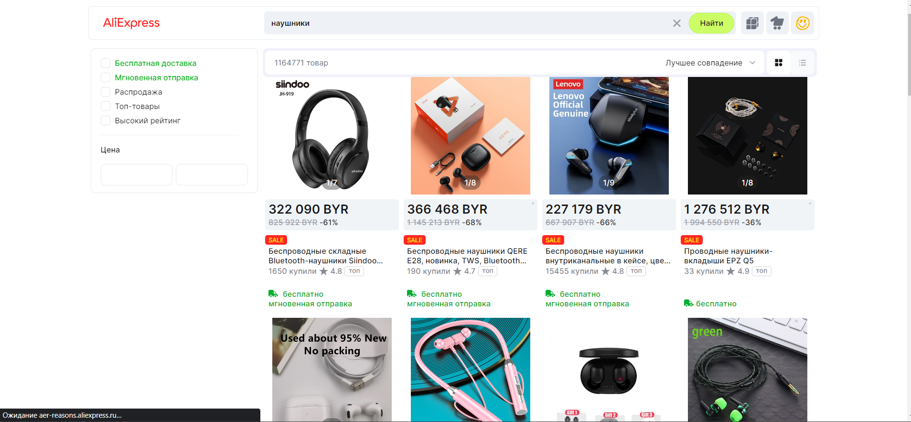
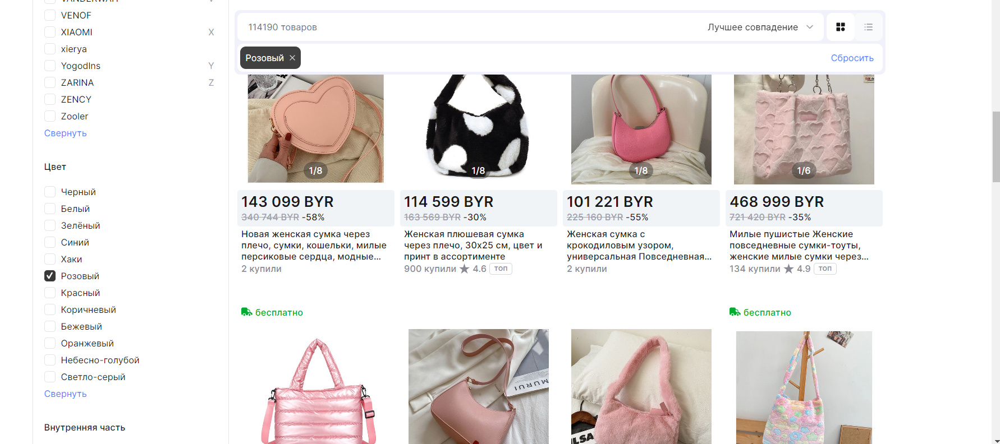

| Идентификатор | Описание                           | Шаги                                                                                                                                                                                                                                                | Входные данные                                | Ожидаемые результаты                                                       | Фактические результаты                                              | Статус          |
|---------------|------------------------------------|-----------------------------------------------------------------------------------------------------------------------------------------------------------------------------------------------------------------------------------------------------|-----------------------------------------------|----------------------------------------------------------------------------|---------------------------------------------------------------------|-----------------|
| TU01          | Регистрация нового пользователя | 1. Перейти на главную страницу AliExpress. 2.Нажать на кнопку "Войти/Зарегистрироваться" 3. Выбрать "Зарегистрироваться" 4. Заполнить обязательные поля (номер телефона) 5. Нажать кнопку "Зарегистрироваться"                          | Номер телефона                                | Пользователь успешно зарегистрирован и перенаправлен на главную страницу   | Как и ожидалось   | Пройден успешно |
| TU02          | Поиск товара | 1. Перейти на главную страницу AliExpress  2. Ввести в поле поиска ключевое слово 3. Нажать кнопку Найти                                                                                                                                    | Ключевое слово = наушники                     | Отобразятся результаты поиска, соответствующие введенному ключевому слову. | Как и ожидалось                              | Пройден успешно |
| TU03          | Фильтрация товара| 1. Перейти на главную страницу AliExpress  2. Ввести в поле поиска ключевое слово 3. Нажать кнопку Найти 4. Использовать фильтры на странице результатов поиска для ограничения результатов| Ключевое слово = сумка, фильтр = розовый цвет | Результат поиска должен быть ограничен в соответствии с выбранным фильтром | Как и ожидалось                                                      | Пройден успешно |

