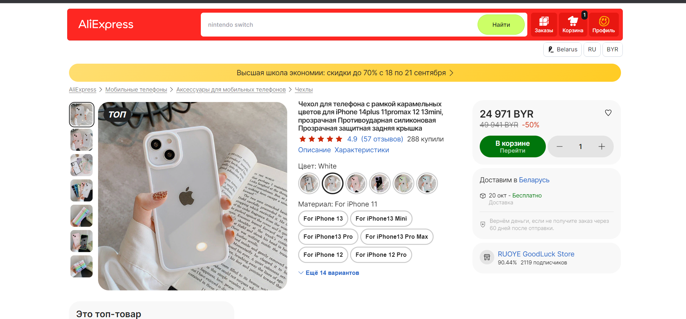
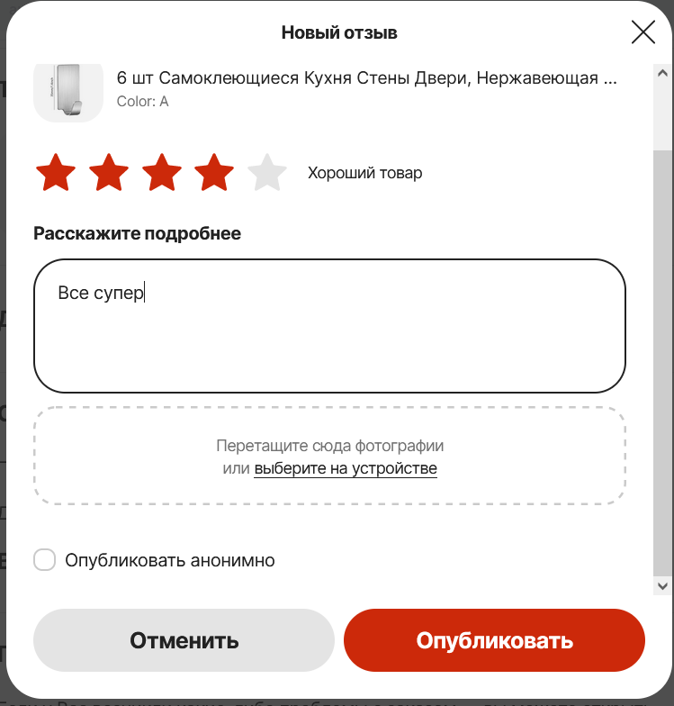

| Идентификатор | Описание                        | Шаги                                                                                                                                                                                                                            | Входные данные                                                                                    | Ожидаемые результаты                                                                         | Фактические результаты                                                                | Статус              |
|---------------|---------------------------------|---------------------------------------------------------------------------------------------------------------------------------------------------------------------------------------------------------------------------------|---------------------------------------------------------------------------------------------------|----------------------------------------------------------------------------------------------|---------------------------------------------------------------------------------------|---------------------|
| TU01          | Регистрация нового пользователя | 1. Перейдите на главную страницу AliExpress. 2.Нажмите на кнопку "Войти/Зарегистрироваться" 3. Выберете "Зарегистрироваться" 4. Заполните обязательное поле (номер телефона) 5. Нажмите кнопку "Зарегистрироваться" | Номер телефона                                                                                    | Пользователь успешно зарегистрирован и перенаправлен на главную страницу                     | Как и ожидалось             | Пройден успешно     |
| TU02          | Поиск товара                    | 1. Перейдите на главную страницу AliExpress  2. Введите в поле поиска ключевое слово 3. Нажмите кнопку Найти                                                                                                            | Ключевое слово = наушники                                                                         | Отобразятся результаты поиска, соответствующие введенному ключевому слову.                   | Как и ожидалось                                              | Пройден успешно     |
| TU03          | Фильтрация товара               | 1. Перейдите на главную страницу AliExpress  2. Введите в поле поиска ключевое слово 3. Нажмите кнопку Найти 4. Используйте фильтры на странице результатов поиска для ограничения результатов                      | Ключевое слово = сумка, фильтр = розовый цвет                                                     | Результат поиска должен быть ограничен в соответствии с выбранным фильтром                   | Как и ожидалось                                          | Пройден успешно     |
| TU04          | Добавление товара в корзину     | 1. Перейдите на главную страницу AliExpress   2. Выберите нужный товар 3. Нажмите на кнопку В корзину 4. Перейдите в корзину                                                                                        | Ключевое слово = чехол Выбранный товар = чехол на айфон 14 Количество = 1                 | Выбранный товар находится в корзине, и отображается его количество и общая стоимость.        | Как и ожидалось                     | Пройден успешно     |
| TU05          | Добавление адреса доставки      | 1. Перейдите в профиль AliExpress   2. Откройте адреса доставки 3. Выберите страну, область, город. Введите улицу, индекс                                                                                               | Страна = Belarus, Область = Grodnenskaya oblast, Город = Ive, Улица = vjkdjvbsk , Индекс = 213135 | Адрес не добавится, потому что указана неправильная улица и не соответствующий городу индекс | Адрес добавился!                    | Пройден некорректно |
| TU06          | Изменение валюты                | 1. Перейдите на главную страницу AliExpress   2. Измените валюту                                                                                                                                                        | Текущая валюта = BYN, Измененная валюта = USD                                                     | Корректное изменение валюты                                                                  | Как и ожидалось                                           | Пройден успешно     |
| TU07          | Добавление комментария          | 1. Перейдите на страницу Заказы AliExpress   2. Выберите товар  3. Оставьте комментарий                                                                                                                                 | Комментарий = все супер                                                                           | Комментарий добавлен на страницу                                                             | Комментарий добавиться через 48 часов  | Пройден успешно     |
| TU08          | Привязка карта                  | 1. Перейдите в корзину AliExpress   2. Нажмите оформить заказ   3. Добавьте данные карты                                                                                                                                | Данные карты: номер = 3482 7985 0708 5878 , срок действия  = 02/56 , CVV = 1111                   | Данные карты введены некорректно                                                             | Как и ожидалось                                          | Пройден успешно     |
| TU09          | Сортировка товаров              | 1. Перейдите на главную страницу AliExpress   2. Введите товар в поиск  3. Выберите тип сортировки                                                                                                                  | Ключевое слово = носки , тип сортировки = самые дешевые                                           | Товары будут расположены в соответствии с ценой(по возрастанию)                              | Как и ожидалось                                          | Пройден успешно     |
| TU10          | Проверка информации о товаре    | 1. Перейдите на главную страницу AliExpress   2. Перейдите на страницу выбранного товара. 2. Просмотрите информацию о товаре на странице.                                                                               | Выбранный товар = джинсы                                                                          | Найдена вся необходимая информация для выбора товара                                         | Как и ожидалось                 | Пройден успешно     |

