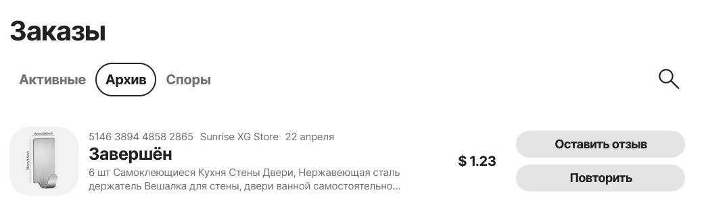

| Идентификатор | Описание                        | Шаги                                                                                                                                                                                                                            | Входные данные                                                                                    | Ожидаемые результаты                                                                         | Фактические результаты                                               | Статус              |
|---------------|---------------------------------|---------------------------------------------------------------------------------------------------------------------------------------------------------------------------------------------------------------------------------|---------------------------------------------------------------------------------------------------|----------------------------------------------------------------------------------------------|----------------------------------------------------------------------|---------------------|
| TU01          | Регистрация нового пользователя | 1. Перейдите на главную страницу AliExpress. 2.Нажмите на кнопку "Войти/Зарегистрироваться" 3. Выберете "Зарегистрироваться" 4. Заполните обязательное поле (номер телефона) 5. Нажмите кнопку "Зарегистрироваться" | Номер телефона                                                                                    | Пользователь успешно зарегистрирован и перенаправлен на главную страницу                     | Как и ожидалось    | Пройден успешно     |
| TU02          | Поиск товара                    | 1. Перейдите на главную страницу AliExpress  2. Введите в поле поиска ключевое слово 3. Нажмите кнопку Найти                                                                                                            | Ключевое слово = наушники                                                                         | Отобразятся результаты поиска, соответствующие введенному ключевому слову.                   | Как и ожидалось                               | Пройден успешно     |
| TU03          | Фильтрация товара               | 1. Перейдите на главную страницу AliExpress  2. Введите в поле поиска ключевое слово 3. Нажмите кнопку Найти 4. Используйте фильтры на странице результатов поиска для ограничения результатов                      | Ключевое слово = сумка, фильтр = розовый цвет                                                     | Результат поиска должен быть ограничен в соответствии с выбранным фильтром                   | Как и ожидалось                           | Пройден успешно     |
| TU04          | Добавление товара в корзину     | 1. Перейдите на главную страницу AliExpress   2. Выберите нужный товар 3. Нажмите на кнопку В корзину 4. Перейдите в корзину                                                                                        | Ключевое слово = чехол Выбранный товар = чехол на айфон 14 Количество = 1                 | Выбранный товар находится в корзине, и отображается его количество и общая стоимость.        | Как и ожидалось    | Пройден успешно     |
| TU05          | Добавление адреса доставки      | 1. Перейдите в профиль AliExpress   2. Откройте адреса доставки 3. Выберите страну, область, город. Введите улицу, индекс                                                                                               | Страна = Belarus, Область = Grodnenskaya oblast, Город = Ive, Улица = vjkdjvbsk , Индекс = 213135 | Адрес не добавится, потому что указана неправильная улица и не соответствующий городу индекс | Адрес добавился    | Пройден некорректно |
| TU06          | Изменение валюты                | 1. Перейдите на главную страницу AliExpress   2. Измените валюту                                                                                            | Текущая валюта = BYN, Измененная валюта = USD             | Корректное изменение валюты                                                             | Как и ожидалось !! | Пройден успешно     |
| TU07          | Добавление товара в корзину     | 1. Перейдите на главную страницу AliExpress   2. Выберите нужный товар 3. Нажмите на кнопку В корзину 4. Перейдите в корзину                                                                                        | Ключевое слово = чехол Выбранный товар = чехол на айфон 14 Количество = 1                 | Выбранный товар находится в корзине, и отображается его количество и общая стоимость.        | Как и ожидалось    | Пройден успешно     |
| TU08          | Добавление товара в корзину     | 1. Перейдите на главную страницу AliExpress   2. Выберите нужный товар 3. Нажмите на кнопку В корзину 4. Перейдите в корзину                                                                                        | Ключевое слово = чехол Выбранный товар = чехол на айфон 14 Количество = 1                 | Выбранный товар находится в корзине, и отображается его количество и общая стоимость.        | Как и ожидалось    | Пройден успешно     |
| TU09          | Добавление товара в корзину     | 1. Перейдите на главную страницу AliExpress   2. Выберите нужный товар 3. Нажмите на кнопку В корзину 4. Перейдите в корзину                                                                                        | Ключевое слово = чехол Выбранный товар = чехол на айфон 14 Количество = 1                 | Выбранный товар находится в корзине, и отображается его количество и общая стоимость.        | Как и ожидалось    | Пройден успешно     |
| TU10          | Добавление товара в корзину     | 1. Перейдите на главную страницу AliExpress   2. Выберите нужный товар 3. Нажмите на кнопку В корзину 4. Перейдите в корзину                                                                                        | Ключевое слово = чехол Выбранный товар = чехол на айфон 14 Количество = 1                 | Выбранный товар находится в корзине, и отображается его количество и общая стоимость.        | Как и ожидалось    | Пройден успешно     |

