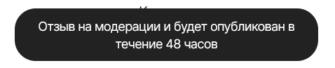

| Идентификатор | Название                     | Шаги                                                                                                                                                                                                     | Входные данные                                                                                    | Ожидаемые результаты                                                                        | Фактические результаты                                                                                      | Статус              |
|---------------|------------------------------|----------------------------------------------------------------------------------------------------------------------------------------------------------------------------------------------------------|---------------------------------------------------------------------------------------------------|---------------------------------------------------------------------------------------------|-------------------------------------------------------------------------------------------------------------|---------------------|
| TU01          | Поиск несуществующего товара | 1. Перейдите на главную страницу AliExpress. 2. Введите в поле поиска ключевое слово 3. Нажмите кнопку Найти                                                                                 | Ключевое слово = дракон из помидор                                                                | Должно отобразиться сообщение с текстом "Ничего не нашли"                                   | Товары отобразились!                                                           | Пройден некорректно |
| TU02          | Поиск товара                 | 1. Перейдите на главную страницу AliExpress  2. Введите в поле поиска ключевое слово 3. Нажмите кнопку Найти                                                                                     | Ключевое слово = наушники                                                                         | Отобразятся результаты поиска, соответствующие введенному ключевому слову.                  | Как и ожидалось                                                                    | Пройден успешно     |
| TU03          | Фильтрация товара            | 1. Перейдите на главную страницу AliExpress  2. Введите в поле поиска ключевое слово 3. Нажмите кнопку Найти 4. Используйте фильтры на странице результатов поиска для ограничения результатов | Ключевое слово = сумка, фильтр = розовый цвет                                                     | Результат поиска должен быть ограничен в соответствии с выбранным фильтром                | Как и ожидалось                                                                | Пройден успешно     |
| TU04          | Добавление товара в корзину  | 1. Перейдите на главную страницу AliExpress   2. Выберите нужный товар 3. Нажмите на кнопку В корзину 4. Перейдите в корзину                                                                 | Ключевое слово = чехол Выбранный товар = чехол на айфон 14 Количество = 1                 | Выбранный товар находится в корзине, и отображается его количество и общая стоимость.       | Как и ожидалось                                           | Пройден успешно     |
| TU05          | Добавление адреса доставки   | 1. Перейдите в профиль AliExpress   2. Откройте адреса доставки 3. Выберите страну, область, город. Введите улицу, индекс                                                                        | Страна = Belarus, Область = Grodnenskaya oblast, Город = Ive, Улица = vjkdjvbsk , Индекс = 213135 | Адрес не добавится, потому что указана неправильная улица и не соответствующий городу индекс | Адрес добавился!                                          | Пройден некорректно |
| TU06          | Изменение валюты             | 1. Перейдите на главную страницу AliExpress   2. Измените валюту                                                                                                                                 | Текущая валюта = BYN, Измененная валюта = USD                                                     | Корректное изменение валюты                                                                 | Как и ожидалось                                           | Пройден успешно     |
| TU07          | Добавление комментария       | 1. Перейдите на страницу Заказы AliExpress   2. Выберите товар  3. Оставьте комментарий                                                                                                          | Комментарий = все супер                                                                           | Комментарий добавлен на страницу                                                            | Комментарий добавиться через 48 часов  | Пройден успешно     |
| TU08          | Привязка карта               | 1. Перейдите в корзину AliExpress   2. Нажмите оформить заказ   3. Добавьте данные карты                                                                                                         | Данные карты: номер = 3482 7985 0708 5878 , срок действия  = 02/56 , CVV = 1111                   | Данные карты введены некорректно                                                            | Как и ожидалось                                                                | Пройден успешно     |
| TU09          | Сортировка товаров           | 1. Перейдите на главную страницу AliExpress   2. Введите товар в поиск  3. Выберите тип сортировки                                                                                           | Ключевое слово = носки , тип сортировки = самые дешевые                                           | Товары будут расположены в соответствии с ценой(по возрастанию)                             | Как и ожидалось                                                                | Пройден успешно     |
| TU10          | Купить сейчас                | 1. Перейдите на главную страницу AliExpress   2. Перейдите на страницу выбранного товара.  3. Нажмите кнопку купить сейчас 4. Заполните нужные данные                                        | Выбранный товар = джинсы                                                                          | Перенаправление на страницу оформления заказа                                               | Как и ожидалось                                                                | Пройден успешно     |

